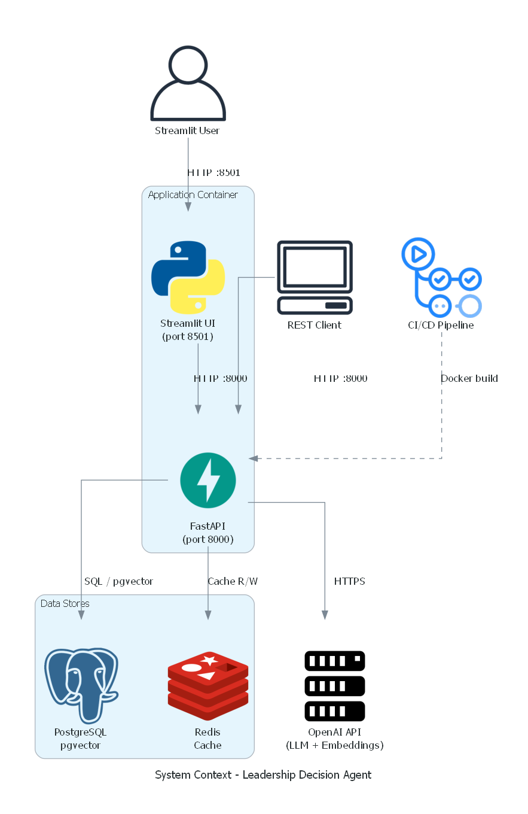

# AI Leadership Insight & Decision Agent

An enterprise-grade AI agent that answers leadership and strategic questions grounded in your company's documents and structured business data. It combines **vector-based semantic search (RAG)** with **natural language to SQL (NL2SQL)** through a LlamaIndex ReAct agent — reasoning step-by-step about which retrieval method to use before synthesizing evidence-grounded answers.



## What It Does

Ask a question like *"What are our Q4 revenue trends and how do they align with the 2026 strategic plan?"* — the agent will:

1. **Reason** about the query (qualitative? quantitative? both?)
2. **Search documents** via semantic vector search for strategy memos, meeting notes, plans
3. **Query structured data** via NL2SQL for KPIs, financial metrics, operational data
4. **Synthesize** a grounded answer with risks, opportunities, and recommendations

### Key Features

- **ReAct Agent** — LlamaIndex agent with 3 tools (`document_search`, `structured_query`, `analyze_context`)
- **Multi-format ingestion** — PDF, DOCX, Markdown, Excel, CSV with automatic chunking and embedding
- **Multi-collection RAG** — isolated vector stores per document collection with independent HNSW configs
- **Streaming responses** — Server-Sent Events for real-time answer generation
- **Enterprise security** — input sanitization, prompt injection detection, PII masking (Presidio), rate limiting
- **Observability** — structlog + OpenTelemetry tracing + Prometheus metrics
- **Production-ready** — Docker multi-stage build, Terraform (AWS ECS Fargate), CI/CD via GitHub Actions

## Quick Start

### Prerequisites

- [Python 3.12+](https://www.python.org/downloads/)
- [uv](https://docs.astral.sh/uv/getting-started/installation/) (Astral package manager)
- [Docker](https://docs.docker.com/get-docker/) and Docker Compose
- An [OpenAI API key](https://platform.openai.com/api-keys)

### Setup

```bash
git clone https://github.com/s1v4-d/leadership-decision-assistant.git
cd leadership-decision-assistant

make init              # Install dependencies + pre-commit hooks
cp .env.example .env   # Then edit .env and set your OPENAI_API_KEY
make start             # Start the full stack (FastAPI + Streamlit + PostgreSQL + Redis)
```

### Access

| Service | URL |
|---------|-----|
| **Streamlit Chat UI** | http://localhost:8501 |
| **FastAPI (REST API)** | http://localhost:8000 |
| **Interactive API Docs** | http://localhost:8000/docs |

On first startup, the app automatically seeds sample leadership documents and KPI data so you can start querying immediately.

### Verify

```bash
curl http://localhost:8000/health    # {"status": "healthy", ...}
curl http://localhost:8000/ready     # {"status": "ready", ...}
```

## Usage

### Ask the Agent (recommended)

```bash
curl -X POST http://localhost:8000/api/v1/agent \
  -H "Content-Type: application/json" \
  -d '{"query": "What are our Q4 2025 revenue trends?"}'
```

The agent reasons through the query, selects tools, and returns a grounded answer:

```json
{
  "answer": "Based on the quarterly review and business metrics...",
  "tool_calls_count": 2
}
```

### Direct RAG Query (with caching)

```bash
curl -X POST http://localhost:8000/api/v1/query \
  -H "Content-Type: application/json" \
  -d '{"query": "What was discussed in the February leadership meeting?"}'
```

### Upload Documents

```bash
curl -X POST http://localhost:8000/api/v1/ingest \
  -F "files=@my_report.pdf" \
  -F "files=@kpis.xlsx"
```

### Stream Responses

Pass `"stream": true` to get Server-Sent Events:

```bash
curl -N -X POST http://localhost:8000/api/v1/agent \
  -H "Content-Type: application/json" \
  -d '{"query": "Summarize our strategic priorities", "stream": true}'
```

## Project Structure

```
leadership-decision-assistant/
├── backend/src/
│   ├── agents/          # ReAct agent + system prompt
│   ├── api/             # FastAPI app, routers, middleware
│   ├── core/            # Config, LLM provider, security, logging, telemetry
│   ├── ingestion/       # Document processing pipeline + parsers
│   ├── models/          # Pydantic schemas + SQLAlchemy ORM tables
│   └── tools/           # RAG tool (pgvector) + SQL tool (NL2SQL)
├── backend/tests/       # Unit (19), integration (4), evaluation (RAGAS)
├── ui/                  # Streamlit chat interface + API client
├── infra/docker/        # Dockerfile, start.sh, init-db.sql
├── infra/terraform/     # AWS ECS Fargate infrastructure
├── data/sample_documents/  # Sample leadership docs + KPI spreadsheet
├── docs/                # Detailed technical documentation + diagrams
├── docker-compose.yml   # Local dev stack
├── Makefile             # Developer workflow commands
└── pyproject.toml       # All dependencies and tool configuration
```

## Make Targets

| Command | Description |
|---------|-------------|
| `make init` | Install all deps and pre-commit hooks |
| `make tests` | Run linter (ruff), type checker (mypy), and test suite (pytest) |
| `make start` | Start containers in the background |
| `make stop` | Stop containers and prune volumes |
| `make build` | Rebuild containers from scratch |
| `make logs` | Tail logs from all containers |

## Configuration

All settings flow through Pydantic Settings v2 ([`backend/src/core/config.py`](backend/src/core/config.py)). Set variables in `.env`:

| Variable | Default | Description |
|----------|---------|-------------|
| `OPENAI_API_KEY` | — | **Required.** OpenAI API key |
| `LLM_MODEL` | `gpt-4o-mini` | LLM model name |
| `LLM_PROVIDER` | `openai` | LLM backend (`openai`, `anthropic`) |
| `DEBUG` | `true` | Enables API docs and hot-reload |
| `POSTGRES__HOST` | `localhost` | PostgreSQL host |
| `REDIS__URL` | `redis://localhost:6379/0` | Redis URL |

See [docs/development.md](docs/development.md) for the full configuration reference.

## Documentation

Detailed technical documentation lives in [`docs/`](docs/):

| Document | Description |
|----------|-------------|
| [Architecture](docs/architecture.md) | System design, component details, data flows, diagrams |
| [API Reference](docs/api-reference.md) | All endpoints, request/response schemas, examples |
| [Deployment](docs/deployment.md) | Docker Compose, AWS Terraform, CI/CD pipelines |
| [Development](docs/development.md) | Local setup, testing, configuration reference, contributing |

## Tech Stack

| Layer | Technologies |
|-------|-------------|
| **AI/ML** | LlamaIndex 0.14+ (ReAct agent), OpenAI (gpt-4o-mini, text-embedding-3-small) |
| **Backend** | FastAPI, Pydantic v2, Uvicorn, SSE-Starlette |
| **Data** | PostgreSQL 17 + pgvector 0.8 (HNSW), Redis 7, SQLAlchemy 2 |
| **Security** | Presidio (PII masking), SlowAPI (rate limiting), prompt injection detection |
| **Observability** | structlog, OpenTelemetry, Prometheus |
| **UI** | Streamlit, httpx |
| **Infra** | Docker (multi-stage), Terraform (AWS ECS Fargate), GitHub Actions |
| **Dev** | uv (Astral), Ruff, mypy (strict), pytest, RAGAS |

## License

GPL-3.0-or-later — see [LICENSE](LICENSE) for details.
