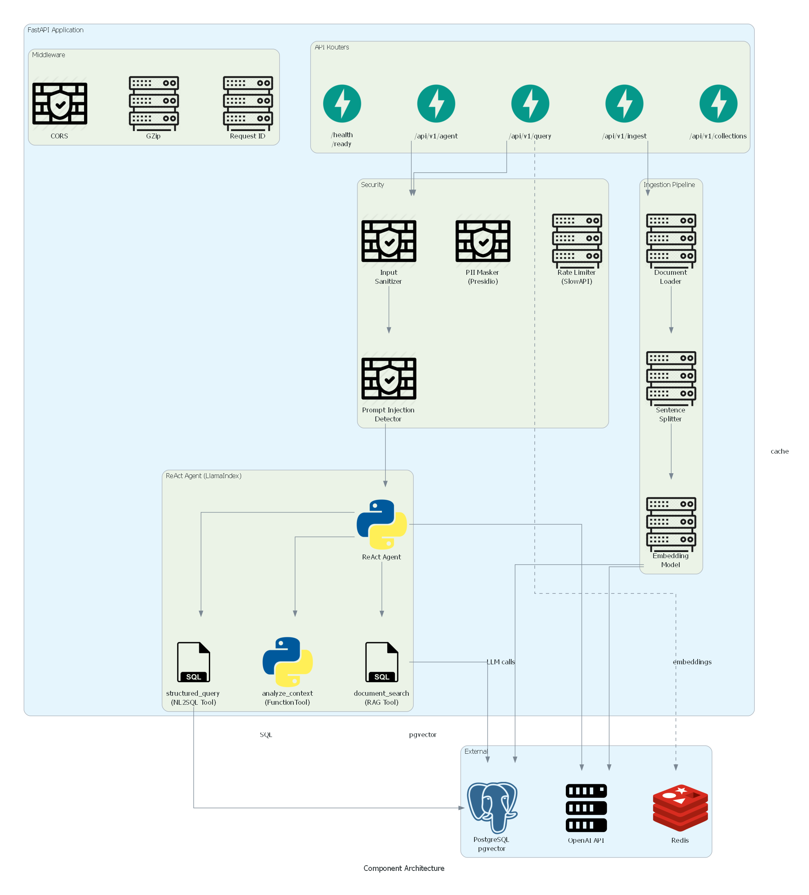
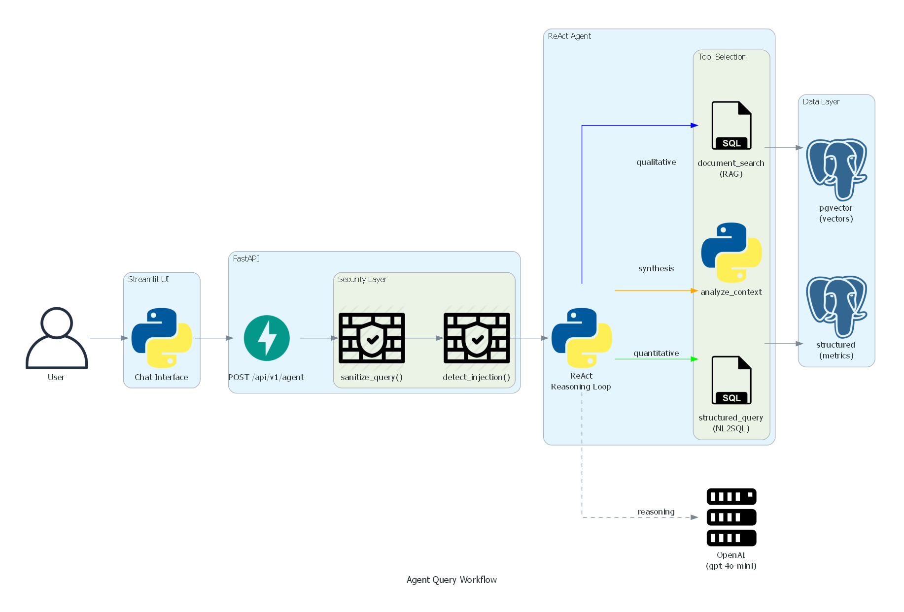
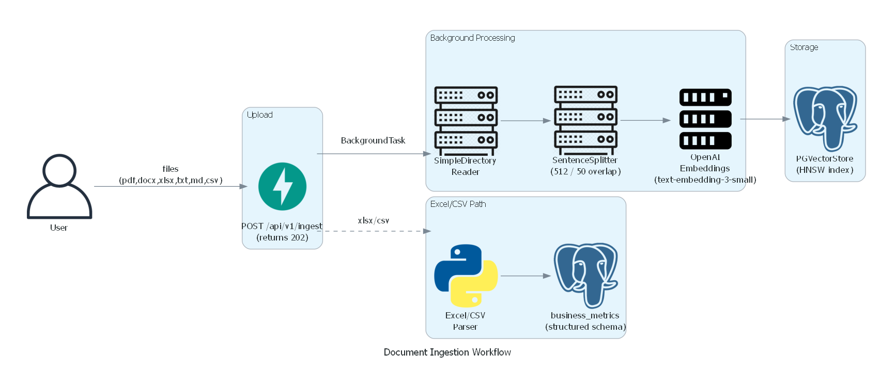
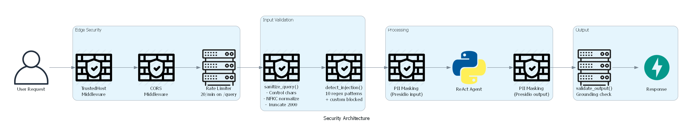
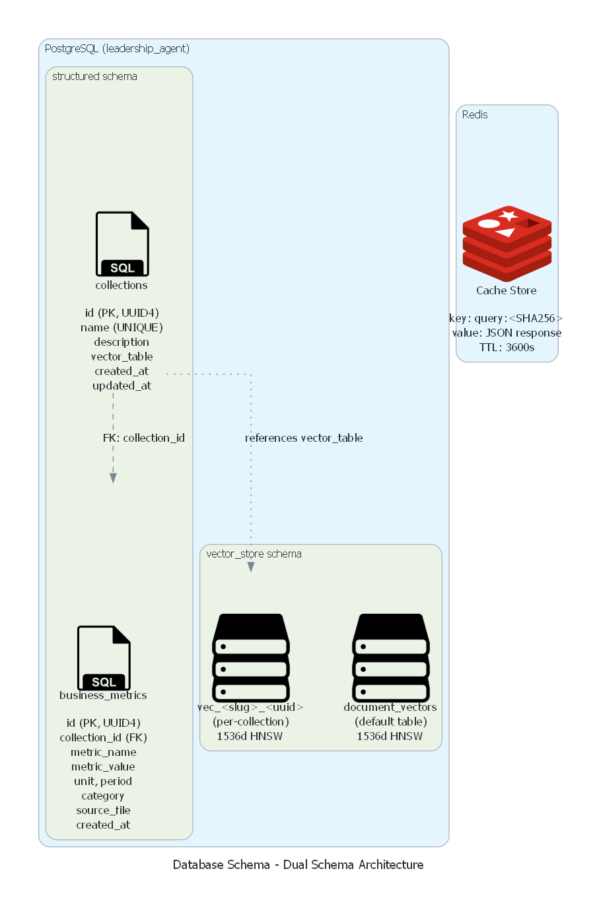
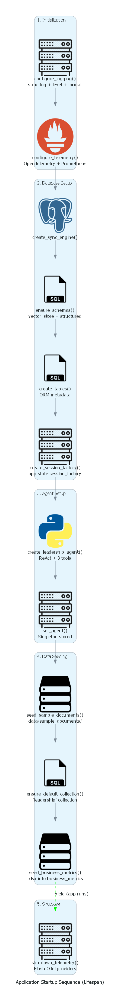

# Architecture

Detailed technical architecture of the AI Leadership Insight & Decision Agent.

## System Context


Users interact through either the **Streamlit chat UI** (port 8501) or direct **REST API** calls (port 8000). The FastAPI backend processes queries through a security layer, routes them to a LlamaIndex ReAct agent, and returns evidence-grounded answers.

The system combines two retrieval paradigms:
- **RAG** — vector-based semantic search over ingested documents stored in PostgreSQL via pgvector
- **NL2SQL** — translation of quantitative questions into SQL against structured business metrics tables

External dependencies:
- **PostgreSQL + pgvector** — dual-schema database (vectors + structured data)
- **Redis** — response caching with configurable TTL
- **OpenAI API** — LLM (gpt-4o-mini) and embeddings (text-embedding-3-small)

---

## Component Architecture



### FastAPI Application

**Entry point:** [`backend/src/api/main.py`](../backend/src/api/main.py)

The app factory `create_app()` builds a fully-configured FastAPI instance:
1. Loads `Settings` via `get_settings()` (cached singleton)
2. Registers middleware: CORS, GZip (responses >= 1000 bytes), TrustedHost, request ID propagation
3. Registers exception handlers for rate limits (429), prompt injection (422), and catch-all (500)
4. Mounts five routers

The `lifespan()` async context manager handles startup and shutdown — see [Startup Sequence](#startup-sequence).

**Middleware stack:**

| Middleware | Purpose |
|---|---|
| `CORSMiddleware` | Configurable origins via `Settings.cors_origins` |
| `GZipMiddleware` | Compress responses >= 1000 bytes |
| `TrustedHostMiddleware` | Host header validation |
| `request_id_middleware` | Injects/propagates `x-request-id` header, binds to structlog context |

### ReAct Agent

**Files:** [`backend/src/agents/leadership_agent.py`](../backend/src/agents/leadership_agent.py), [`backend/src/agents/prompts.py`](../backend/src/agents/prompts.py)

A LlamaIndex `ReActAgent` from `llama_index.core.agent.workflow` that orchestrates three tools:

| Tool | Type | Description |
|------|------|-------------|
| `document_search` | `QueryEngineTool` | Semantic vector search over company documents via pgvector |
| `structured_query` | `QueryEngineTool` | NL2SQL against `business_metrics` table via `NLSQLTableQueryEngine` |
| `analyze_context` | `FunctionTool` | Structures findings into risks, opportunities, and recommendations |

**Construction flow:**
```
Settings
  -> create_llm()              -> LLM instance
  -> create_rag_query_tool()   -> QueryEngineTool("document_search")
  -> create_analysis_tool()    -> FunctionTool("analyze_context")
  -> create_sql_tool()         -> QueryEngineTool("structured_query")
  -> ReActAgent(tools=[...], llm=llm, system_prompt=LEADERSHIP_SYSTEM_PROMPT)
```

The system prompt in `prompts.py` guides tool selection: qualitative questions use `document_search`, quantitative questions use `structured_query`, complex questions use both followed by `analyze_context`.

**Execution functions:**
- `run_agent_query()` — single-shot, returns `AgentResponse(answer, tool_calls_count)`
- `stream_agent_response()` — async generator yielding `AgentStream.delta` events for SSE streaming

### RAG Pipeline

**File:** [`backend/src/tools/rag_tool.py`](../backend/src/tools/rag_tool.py)

Vector search pipeline built on LlamaIndex and pgvector:

```
create_vector_store(settings, table_name?)
  -> PGVectorStore (HNSW: m=16, ef_construction=64, ef_search=40, cosine distance)

create_query_index(settings, table_name?)
  -> VectorStoreIndex.from_vector_store()

create_query_engine(settings, table_name?, collection_id?)
  -> index.as_query_engine(similarity_top_k=5, response_mode=tree_summarize)
```

**Multi-collection support:** Each `Collection` gets its own vector table (`vec_<slug>_<uuid8>`) with independent HNSW configuration. Metadata filtering via `MetadataFilters` scopes queries by `collection_id`.

### NL2SQL Pipeline

**File:** [`backend/src/tools/sql_tool.py`](../backend/src/tools/sql_tool.py)

```
create_sql_database(settings)
  -> SQLDatabase(engine, schema="structured", include_tables=["business_metrics", "collections"])

create_sql_query_engine(settings)
  -> NLSQLTableQueryEngine(sql_database, tables=["business_metrics"], synthesize_response=True)
```

The LLM translates natural language into SQL, executes read-only against the `structured` schema, and synthesizes a natural language answer from the result set.

### Document Ingestion

**Files:** [`backend/src/ingestion/pipeline.py`](../backend/src/ingestion/pipeline.py), [`backend/src/ingestion/parsers.py`](../backend/src/ingestion/parsers.py), [`backend/src/ingestion/excel_parser.py`](../backend/src/ingestion/excel_parser.py)

Two ingestion paths:

**Vector ingestion** (documents into pgvector):
```
Files -> SimpleDirectoryReader -> SentenceSplitter(512, 50) -> OpenAIEmbedding(1536d) -> PGVectorStore
```
Supported formats: `.pdf`, `.docx`, `.txt`, `.md`, `.xlsx`, `.csv`

**Structured ingestion** (Excel/CSV into SQL):
```
.xlsx -> openpyxl parser -> BusinessMetric ORM records -> structured.business_metrics table
```

### LLM Provider

**File:** [`backend/src/core/llm_provider.py`](../backend/src/core/llm_provider.py)

Model-agnostic factory. Application code never imports provider-specific LlamaIndex modules directly:

```python
from backend.src.core.llm_provider import create_llm, create_embed_model

llm = create_llm(settings)            # OpenAI/Anthropic based on LLM_PROVIDER
embed = create_embed_model(settings)   # OpenAIEmbedding by default
```

Supported providers: `openai` (default), `anthropic`, with `ollama` and `huggingface` as optional dependency groups.

---

## Data Flow

### Agent Query Workflow



1. User submits question through Streamlit or REST API
2. FastAPI `sanitize_query()` removes control characters, normalizes Unicode, truncates
3. `detect_prompt_injection()` checks 10 regex patterns + custom blocked patterns
4. ReAct agent enters reasoning loop:
   - **Thought** — decides which tool(s) to call
   - **Action** — calls `document_search` and/or `structured_query`
   - **Observation** — receives tool results
   - **Repeat** or **Answer** — synthesizes final response
5. Response returned with `tool_calls_count` metadata

### Document Ingestion Workflow



1. `POST /api/v1/ingest` accepts file uploads, returns 202 immediately
2. `BackgroundTask` processes files through the pipeline:
   - `SimpleDirectoryReader` loads documents
   - `SentenceSplitter` chunks text (512 tokens, 50 overlap)
   - `OpenAIEmbedding` generates 1536-dimensional vectors
   - `PGVectorStore` stores vectors with HNSW indexing
3. Excel/CSV files are additionally parsed into `business_metrics` SQL table

### RAG Query with Caching

```
POST /api/v1/query
  -> sanitize + injection check
  -> resolve collection_id -> vector_table
  -> build cache key: "query:" + SHA256(sanitized_query)
  -> [cache hit] -> return cached QueryResponse
  -> [cache miss]
      -> VectorStoreIndex.from_vector_store()
      -> index.as_query_engine(top_k=5, mode=tree_summarize)
      -> engine.query(sanitized_text)
      -> store in Redis (TTL 3600s)
      -> return QueryResponse
```

---

## Security Architecture



Multi-layered security pipeline defined in [`backend/src/core/security.py`](../backend/src/core/security.py):

| Layer | Function | Details |
|-------|----------|---------|
| **Edge** | `TrustedHostMiddleware` | Host header validation |
| **Edge** | `CORSMiddleware` | Origin allowlist |
| **Edge** | `SlowAPI` | Rate limiting (20/min on `/api/v1/query`) |
| **Input** | `sanitize_query()` | Control char removal, NFKC normalization, whitespace collapse, 2000 char truncation |
| **Input** | `detect_prompt_injection()` | 10 built-in regex patterns + configurable `blocked_patterns`. Raises HTTP 422 |
| **Processing** | `mask_pii()` | Presidio-based PII detection and anonymization (lazy-loaded, graceful fallback) |
| **Output** | `validate_output()` | Grounding check (source_count > 0), optional PII masking on answers |

---

## Database Design



Single PostgreSQL database (`leadership_agent`) with dual-schema architecture, initialized by [`infra/docker/init-db.sql`](../infra/docker/init-db.sql):

### `vector_store` schema

Managed by `PGVectorStore` (LlamaIndex):
- `document_vectors` — default vector table (1536 dimensions, HNSW index)
- `vec_<collection_slug>_<uuid8>` — per-collection vector tables created dynamically

### `structured` schema

Managed by SQLAlchemy ORM ([`backend/src/models/tables.py`](../backend/src/models/tables.py)):

**`collections` table:**
| Column | Type | Constraints |
|--------|------|-------------|
| `id` | `VARCHAR(36)` | PK, UUID4 default |
| `name` | `VARCHAR(255)` | UNIQUE, NOT NULL |
| `description` | `TEXT` | nullable |
| `vector_table` | `VARCHAR(255)` | NOT NULL |
| `created_at` | `TIMESTAMPTZ` | default `NOW()` |
| `updated_at` | `TIMESTAMPTZ` | default `NOW()`, onupdate |

**`business_metrics` table:**
| Column | Type | Constraints |
|--------|------|-------------|
| `id` | `VARCHAR(36)` | PK, UUID4 default |
| `collection_id` | `VARCHAR(36)` | FK -> collections.id, NOT NULL |
| `metric_name` | `VARCHAR(255)` | NOT NULL |
| `metric_value` | `DOUBLE PRECISION` | NOT NULL |
| `unit` | `VARCHAR(50)` | nullable |
| `period` | `VARCHAR(50)` | nullable |
| `category` | `VARCHAR(100)` | nullable |
| `source_file` | `VARCHAR(512)` | nullable |
| `created_at` | `TIMESTAMPTZ` | default `NOW()` |

### Redis Cache

Used in [`backend/src/api/query_routes.py`](../backend/src/api/query_routes.py):
- **Key:** `query:<SHA256(sanitized_query)>`
- **Value:** JSON-serialized `QueryResponse`
- **TTL:** 3600 seconds (configurable via `REDIS__TTL_SECONDS`)
- Gracefully optional — all cache operations return None / no-op on failure

---

## Observability

**Files:** [`backend/src/core/log.py`](../backend/src/core/log.py), [`backend/src/core/telemetry.py`](../backend/src/core/telemetry.py)

### Structured Logging

- **Library:** structlog with `ProcessorFormatter`
- **Renderers:** `JSONRenderer` (production, `LOG_FORMAT=json`), `ConsoleRenderer` (dev)
- **Request scoping:** `structlog.contextvars` binds `request_id` per request via middleware
- **Trace correlation:** `trace_id` and `span_id` from OpenTelemetry injected into every log record

### OpenTelemetry

- **Tracing:** `TracerProvider` with `BatchSpanProcessor` -> OTLP (gRPC) or console exporter
- **Metrics:** `MeterProvider` with `PrometheusMetricReader` for Prometheus scraping
- **FastAPI instrumentation:** auto-instruments requests (excludes `/health`, `/ready`, `/metrics`)

### Application Metrics

| Metric | Type | Name |
|--------|------|------|
| Query count | Counter | `app.query.count` |
| Query latency | Histogram | `app.query.latency` |
| Ingestion runs | Counter | `app.ingestion.count` |
| Documents ingested | Counter | `app.ingestion.documents` |
| Active queries | UpDownCounter | `app.query.active` |
| Cache hits | Counter | `app.query.cache_hits` |

---

## Startup Sequence



The FastAPI `lifespan()` context manager runs on startup/shutdown:

**Startup (in order):**
1. `configure_logging()` — structlog with level and format from settings
2. `configure_telemetry()` — OpenTelemetry tracing + Prometheus metrics
3. `create_sync_engine()` — SQLAlchemy engine
4. `ensure_schemas()` — creates `vector_store` and `structured` PostgreSQL schemas
5. `create_tables()` — ORM `Base.metadata.create_all()`
6. `create_session_factory()` — stores `sessionmaker` on `app.state.session_factory`
7. `create_leadership_agent()` + `set_agent()` — initializes ReAct agent singleton with 3 tools
8. `seed_sample_documents()` — ingests `data/sample_documents/` if vector store is empty
9. `_ensure_default_collection()` — creates "leadership" collection
10. `seed_business_metrics()` — ingests `.xlsx` data into `business_metrics`

**Shutdown:**
1. `shutdown_telemetry()` — flushes and shuts down OTel providers
