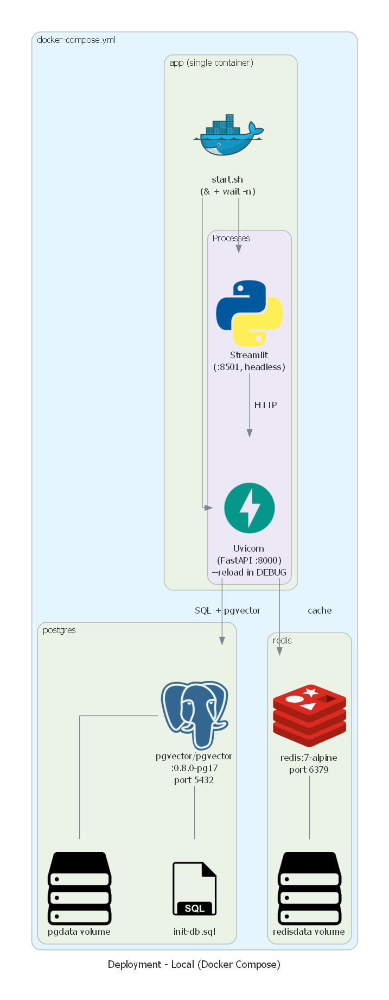
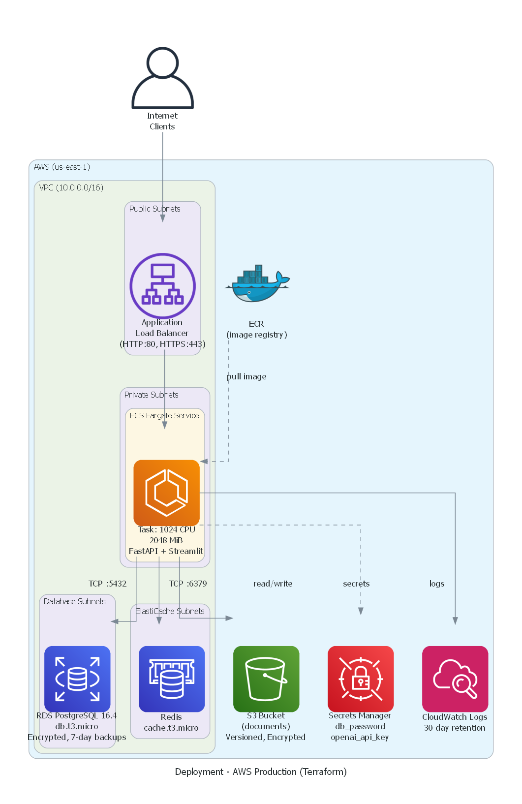
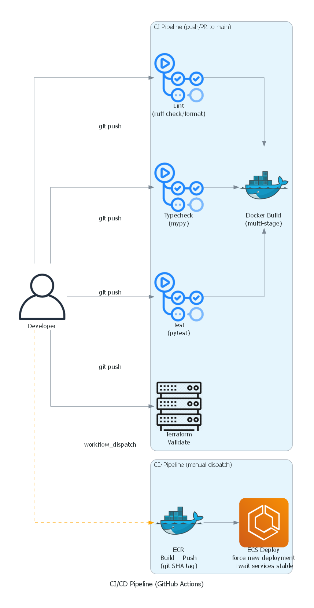

# Deployment

Guide for deploying the Leadership Decision Agent locally and to AWS production.

---

## Docker Compose (Local)



### Services

The [`docker-compose.yml`](../docker-compose.yml) defines three services:

| Service | Image | Ports | Purpose |
|---------|-------|-------|---------|
| `app` | Custom multi-stage build | 8000, 8501 | FastAPI + Streamlit in a single container |
| `postgres` | `pgvector/pgvector:0.8.0-pg17` | 5432 | Vector store + structured data |
| `redis` | `redis:7-alpine` | 6379 | Response caching |

### Commands

```bash
make start    # docker compose up -d
make stop     # docker compose down -v --remove-orphans
make build    # Full rebuild from scratch (docker compose build --no-cache)
make logs     # docker compose logs -f
```

### Container Architecture

The [`Dockerfile`](../infra/docker/Dockerfile) uses a two-stage build:

**Stage 1 — Builder:**
- Base: `python:3.12-slim` with `ghcr.io/astral-sh/uv:0.6.6`
- Runs `uv sync --locked --no-install-project` with Docker build cache mounts
- Produces a complete `.venv` with all dependencies

**Stage 2 — Runtime:**
- Base: `python:3.12-slim`
- Non-root `app` user
- Copies `.venv` from builder, sets `PATH="/app/.venv/bin:$PATH"`
- Health check: `curl -f http://localhost:8000/health`
- Entrypoint: [`infra/docker/start.sh`](../infra/docker/start.sh)

The [`start.sh`](../infra/docker/start.sh) entrypoint runs both processes:
```bash
uvicorn backend.src.api.main:create_app --factory \
    --host 0.0.0.0 --port 8000 --workers "$WORKERS" $RELOAD_FLAG &

streamlit run ui/app.py \
    --server.port 8501 --server.address 0.0.0.0 \
    --server.headless true &

wait -n    # Exit if either process fails
```

When `DEBUG=true`:
- Uvicorn runs with `--reload --reload-dir /app/backend --reload-dir /app/ui`
- Workers forced to 1 (required for reload)
- Volume mounts (`./backend`, `./ui`) enable hot-reload

### Database Initialization

[`infra/docker/init-db.sql`](../infra/docker/init-db.sql) runs on first PostgreSQL startup:
1. Enables `pgvector` extension
2. Creates `vector_store` and `structured` schemas
3. Creates `collections` and `business_metrics` tables
4. Grants schema permissions

---

## AWS Production (Terraform)



Production infrastructure is defined in [`infra/terraform/`](../infra/terraform/) targeting AWS ECS Fargate.

### Resources

| Resource | Terraform Type | Configuration |
|----------|---------------|---------------|
| **VPC** | `terraform-aws-modules/vpc/aws ~> 6.0` | 2 AZs, public/private/database/elasticache subnets, single NAT gateway |
| **ALB** | `aws_lb` + target group + listener | HTTP:80, HTTPS:443 -> ECS (port 8000), health check on `/health` |
| **ECS Cluster** | `aws_ecs_cluster` | Container Insights enabled |
| **ECS Service** | `aws_ecs_service` | Fargate, private subnets, deployment circuit breaker with rollback |
| **ECS Task** | `aws_ecs_task_definition` | 1024 CPU / 2048 MiB, Fargate launch type |
| **RDS** | `aws_db_instance` | PostgreSQL 16.4, `db.t3.micro`, encrypted, 20-100GB auto-scaling, 7-day backup retention |
| **ElastiCache** | `aws_elasticache_cluster` | Redis, `cache.t3.micro`, single node |
| **ECR** | `aws_ecr_repository` | Image scanning on push |
| **S3** | `aws_s3_bucket` | Document storage, versioned, AES256 encrypted, public access blocked |
| **Secrets Manager** | `aws_secretsmanager_secret` | `db_password`, `openai_api_key` |
| **CloudWatch** | `aws_cloudwatch_log_group` | `/ecs/leadership-agent-{env}`, 30-day retention |

### Security Groups

Least-privilege network access:

| Group | Ingress | Source |
|-------|---------|--------|
| ALB | 80, 443 | Internet |
| ECS | 8000, 8501 | ALB only |
| Database | 5432 | ECS only |
| Redis | 6379 | ECS only |

### ECS Task Environment

Environment variables injected into the ECS task:

| Variable | Source |
|----------|--------|
| `POSTGRES__HOST` | RDS endpoint |
| `POSTGRES__PORT` | `5432` |
| `POSTGRES__DATABASE` | RDS database name |
| `POSTGRES__USER` | RDS username |
| `POSTGRES__PASSWORD` | AWS Secrets Manager |
| `OPENAI_API_KEY` | AWS Secrets Manager |
| `REDIS__URL` | ElastiCache endpoint |
| `LLM_PROVIDER` | `bedrock` (production) |
| `LOG_FORMAT` | `json` |
| `DEBUG` | `false` |

### IAM Roles

- **Execution role:** ECR pull, CloudWatch logs, Secrets Manager read
- **Task role:** S3 read/write (`${name}-documents` bucket), Bedrock `InvokeModel`

### Deploying

```bash
cd infra/terraform

# Initialize
terraform init

# Plan with environment-specific vars
terraform plan -var-file=environments/staging.tfvars

# Apply
terraform apply -var-file=environments/staging.tfvars
```

---

## CI/CD Pipelines



### CI Pipeline

**File:** [`.github/workflows/ci.yml`](../.github/workflows/ci.yml)

Triggered on push/PR to `main` with path filters. All jobs use `astral-sh/setup-uv@v5` with dependency caching.

| Job | Steps | Depends On |
|-----|-------|------------|
| `lint` | `ruff check .` -> `ruff format --check .` | — |
| `typecheck` | `mypy backend/src/` | — |
| `test` | Unit tests -> Integration tests (`-m integration`) -> Eval tests (`-m "not evaluation"`) | — |
| `docker-build` | Build Docker image | lint, typecheck, test |
| `terraform` | `terraform fmt -check` -> `terraform init -backend=false` -> `terraform validate` | — |

Concurrency group cancels in-progress runs on the same branch.

### CD Pipeline

**File:** [`.github/workflows/cd.yml`](../.github/workflows/cd.yml)

Manually triggered via `workflow_dispatch` with environment selection (staging/production).

| Job | Steps |
|-----|-------|
| `build-and-push` | AWS credentials -> ECR login -> Docker build with git SHA tag -> Push to ECR |
| `deploy` | Fetch current task definition -> Update container image -> `aws ecs update-service --force-new-deployment` -> `aws ecs wait services-stable` |

### Deployment Flow

```
Developer
  -> git push to main
  -> CI: lint + typecheck + test + docker build + terraform validate
  -> (manual) workflow_dispatch with environment=staging
  -> CD: build image (tag: git SHA) -> push to ECR -> deploy to ECS
  -> ECS rolling update with circuit breaker
  -> aws ecs wait services-stable (health check passes)
```
